# Forno — multi-venue hospitality operations portal

A front-desk portal for a restaurant chain. Each venue's PC binds itself to that
venue's account; the diary, tasks, supply prices and guest book follow from
there, and any admin can switch venues the moment a call is forwarded.

## Screenshots

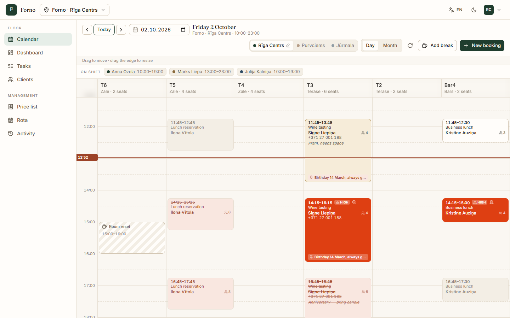
**Day diary** — one column per table, drag to move, overlaps flagged, current-time rule

| | |
| --- | --- |
| 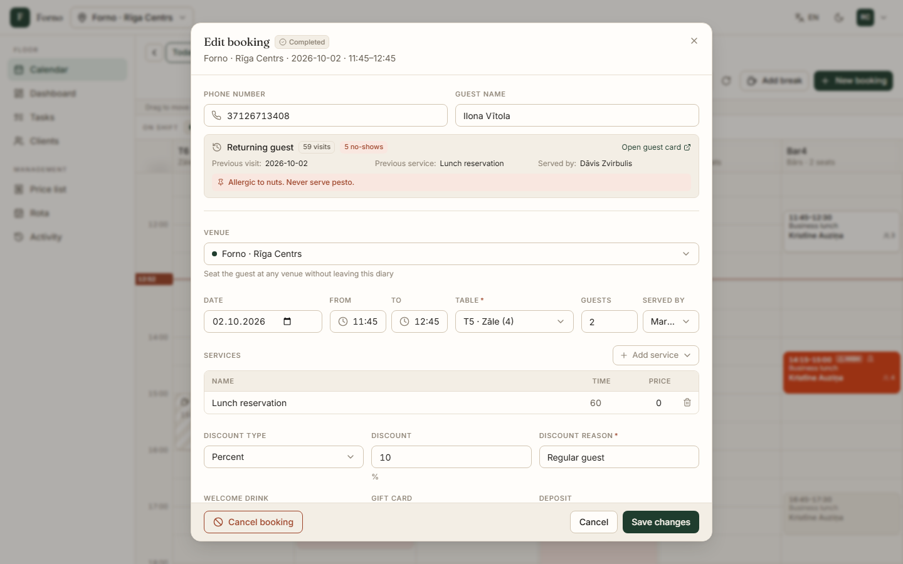 **Booking dialog** — returning guest, permanent note, venue, services, discount with reason | 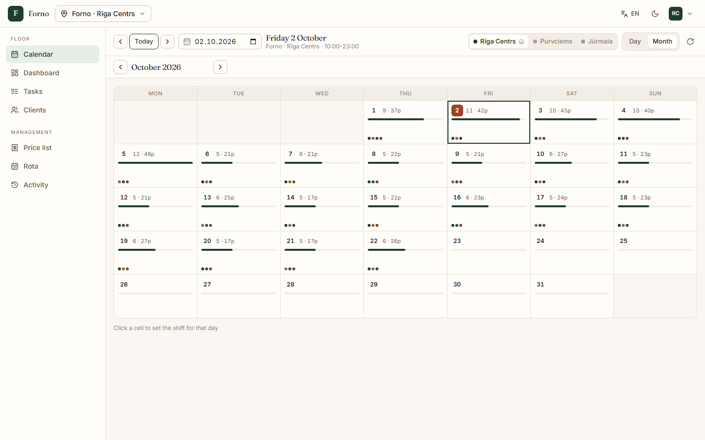 **Month view** — per-day load and who is rostered |
| 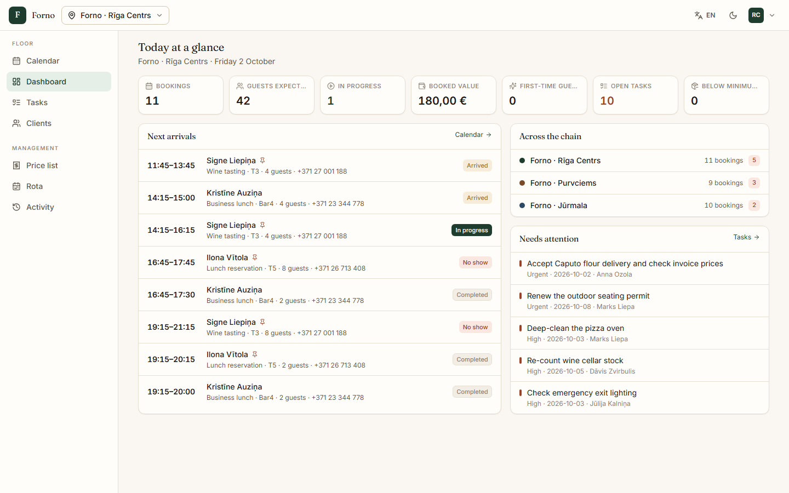 **Dashboard** — today's numbers, next arrivals, chain comparison | 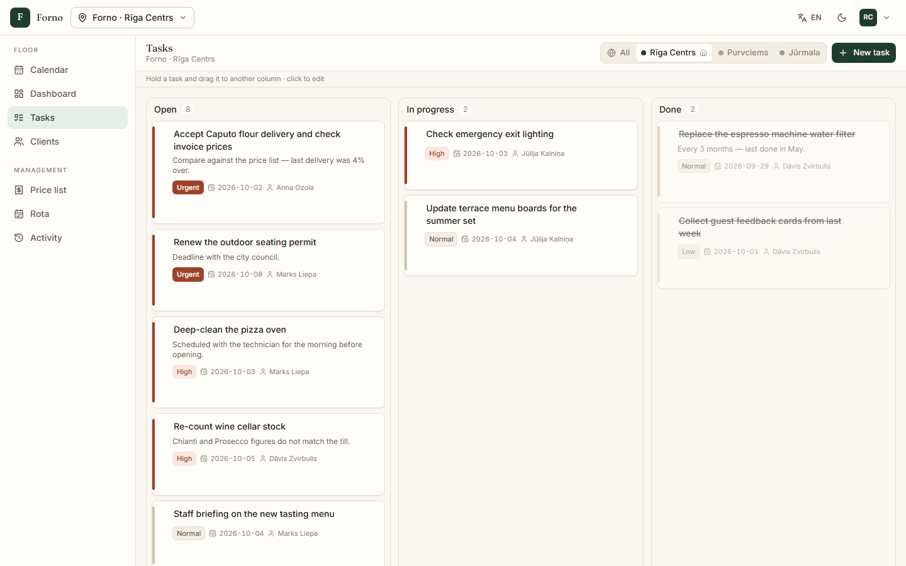 **Tasks** — per-venue board, drag between columns |
| 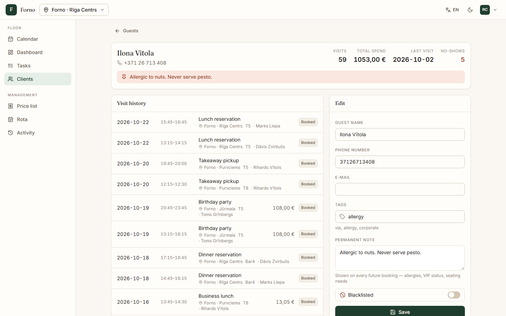 **Guest card** — history across venues, discounts and cancellations | 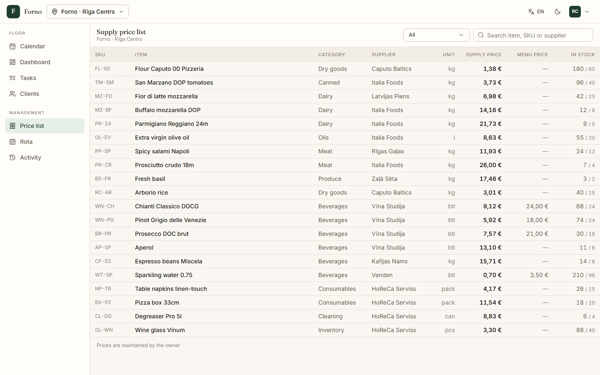 **Price list** — supply vs menu price, stock against its floor |
| 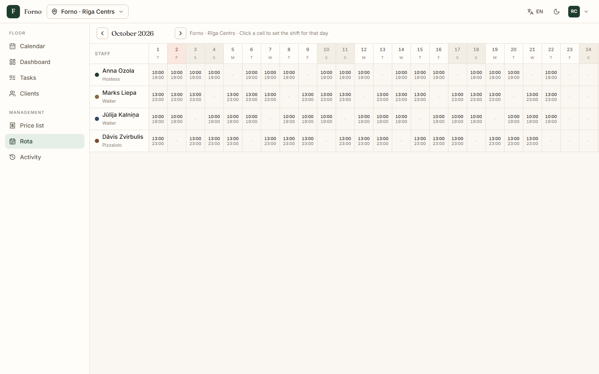 **Rota** — staff × days for the month | 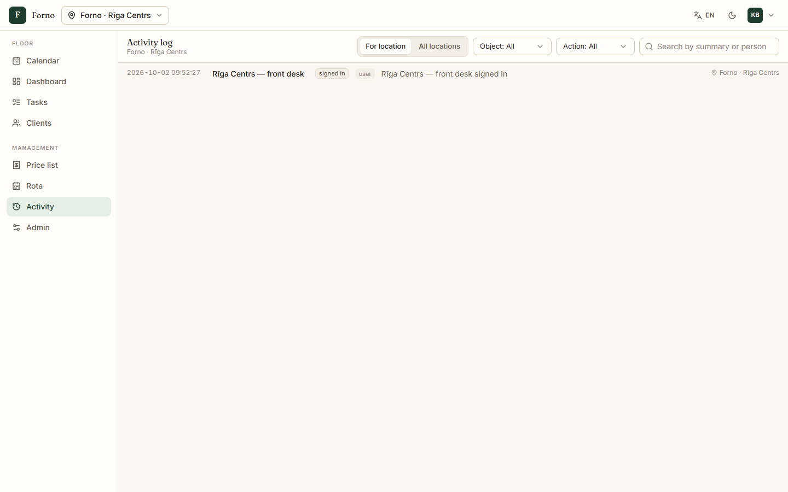 **Activity** — every write, cross-venue actions highlighted |
| 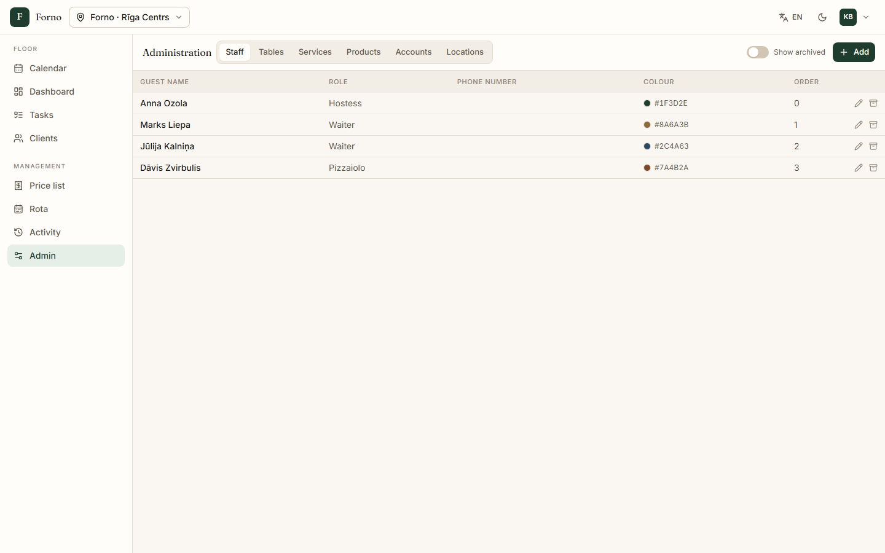 **Admin** — owner-only reference data | 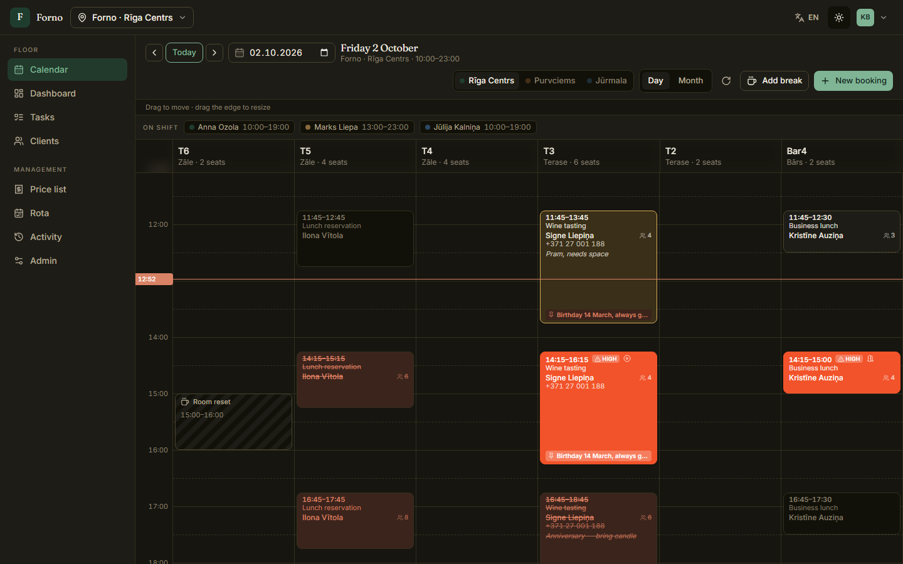 **Dark theme** |
| 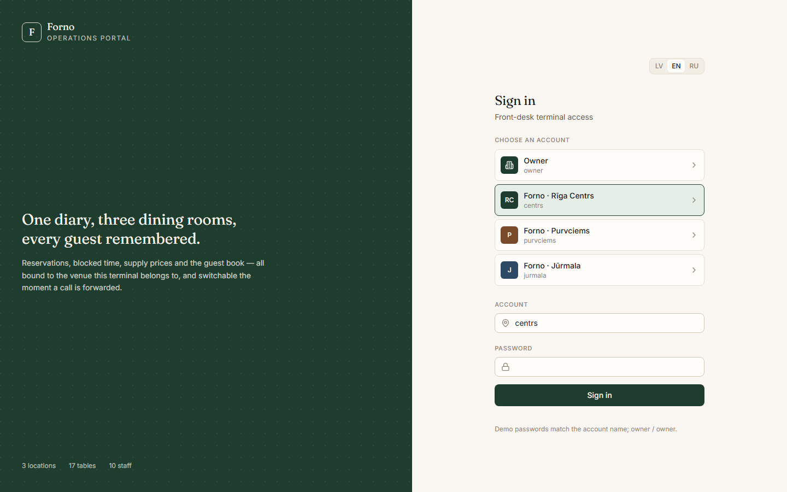 **Sign in** — the terminal binds to its venue | |

Screenshots are generated by `npm run docs:screenshots` from a freshly seeded stack.

## Documentation

| Document | What's in it |
| --- | --- |
| [Architecture](docs/ARCHITECTURE.md) | Deployment topology, request lifecycle and booking flowcharts, drag-and-drop sequence, data model, key decisions |
| [API reference](docs/API.md) | Every endpoint, request/response shapes, conflict handling, error codes |
| [Contributing](CONTRIBUTING.md) | Setup, test suites, conventions, how to submit a change |

## Run it

### Docker (production-like: nginx + API)

```bash
cp .env.example .env        # then set JWT_SECRET to a long random string
docker compose up -d --build
```

Open http://localhost:8080. nginx serves the built UI and proxies `/api` to the
API container; the SQLite database lives in the `forno-data` volume and is
seeded with demo data on first start (`SEED_ON_START` in `.env` controls this).

### Local development

Requires Node 24.

```bash
npm install
npm run seed     # 3 venues, 17 tables, 10 staff, 12 guests, ~640 bookings
npm run dev      # API on :4000, UI on :5173
```

Open http://localhost:5173.

### Demo accounts

| Account | Password | Role |
| --- | --- | --- |
| `owner` | `owner` | Owner — full access, edits all reference data |
| `centrs` | `centrs` | Admin — Rīga Centrs front desk |
| `purvciems` | `purvciems` | Admin — Purvciems front desk |
| `jurmala` | `jurmala` | Admin — Jūrmala front desk |

## Tests

```bash
npm test                     # unit + API integration suite (59 checks), self-contained
npx playwright install chromium
npm run test:e2e             # 33 Playwright browser tests against a seeded dev stack
```

The API suite covers booking, conflicts, drag-moves, cancellation and discount
rules, forwarded calls, permissions and the audit trail. The browser suite
drives the real UI: sign-in and device binding, creating, moving, cancelling
and double-booking reservations, guest autofill, venue switching, tasks, guests,
price list and every screen for both roles. Both suites can also run against
the docker stack — see [CONTRIBUTING.md](CONTRIBUTING.md#tests).

## Stack

- **API** — Express on Node 24, storage via the built-in `node:sqlite`. No
  native modules, no ORM, no build step for the server.
- **UI** — React 18 + Vite + Tailwind, shadcn/ui component patterns on Radix
  primitives. The diary grid and its drag layer are hand-written; no calendar
  library.
- **Auth** — JWT with a 30-day life, plus a device binding kept in
  `localStorage` so the terminal remembers its venue across sign-outs.
- **Delivery** — two images (`server/Dockerfile`, `web/Dockerfile`) wired by
  `docker-compose.yml`; nginx serves the SPA with a history fallback, caches
  fingerprinted assets for a year and proxies `/api`.

## How the domain maps

The booking model is resource-based, so it fits any appointment business. In
this build it is dressed for hospitality:

| Model | Here |
| --- | --- |
| resource (calendar column) | table / zone |
| staff | waiter, host, pizzaiolo |
| service | dinner, birthday, corporate, tasting, masterclass |
| break | room reset, terrace reset |
| product | supply item with delivery price and stock floor |

Swapping the seed data turns the same code into a barbershop or a clinic —
`services`, `resources` and `staff` are all owner-editable at runtime.

## What each screen does

**Calendar** — the main screen. One column per table, 15-minute grid, current-time
rule. Drag a block to move it, drag its bottom edge to change duration; every
drop asks for confirmation before saving. Overlaps are rejected by the server
with a conflict dialog offering an explicit override. Hovering a booking shows
service, guest, phone, table, staff and both note kinds; the block itself shows
as much of that as its height allows. Permanent guest notes (allergies, VIP,
access needs) render in clay so they cannot be skimmed past. Month view shows
per-day load and who is rostered.

**Booking dialog** — phone field with typeahead over the guest book: matches
show name, visit count, and the previous visit's service, staff and venue.
Picking one autofills the form. An unknown number raises a first-time-guest
alert; a returning one does not. Services are added as rows (name, minutes,
price) which drive the slot length and the total; discount type/reason/value,
gift card, welcome drink and deposit all feed the sum. Notes are split into a
per-visit note and a permanent note on the guest card. Cancelling requires a
written reason — enforced in the dialog *and* in the API. "Details" expands the
full activity trail: who booked it, from which venue, when, and every later
change.

**Dashboard** — today's counts, chain-wide comparison, next arrivals, hot tasks.

**Tasks** — per-venue board by status and priority, with due dates, assignees
and overdue marking. Switchable to a chain-wide view.

**Price list** — what the admin opens when a delivery arrives: search by item,
SKU or supplier, supply price, menu price with margin, stock against its floor.
Owners edit prices inline.

**Guests** — searchable guest book. The card carries visit history across all
venues, plus a dedicated discounts-and-cancellations trail so every price
change has its stated reason attached.

**Rota** — staff × days grid for a whole month. Click a cell to set a shift; the
wand fills the rest of the month from one pattern with an optional weekly day
off.

**Admin** (owner only) — staff, tables, services, products, accounts and venues.
Deletes are soft, so retired staff and tables still resolve in history.

**Activity** — every write in the system, filterable by venue, object and action.
Cross-venue actions are highlighted: `Rīga Centrs → Purvciems` means that desk
took a forwarded call.

## Design

Warm-premium: cream `#FAF7F2`, deep green `#1F3D2E`, Fraunces for headings,
Inter for body, tabular figures for every time and price. Chrome is deliberately
neutral so colour can be spent entirely on booking state — booked, arrived,
in progress (solid green), completed, cancelled, no-show. Priority rides on
top as a ring: gold for VIP, clay for high. Light and dark themes are both
defined as token sets; the toggle is in the top bar.

Three languages — Latvian, English, Russian — switchable at any time, including
on the login screen. English backs any key a translation has not reached yet.

## Layout

```
server/       Express API, schema, seed, API test suite, Dockerfile
web/          React UI, Vite config, nginx config, Dockerfile
e2e/          Playwright browser tests
docs/         architecture, API reference, screenshots
scripts/      screenshot generator
```

The full breakdown is in [docs/ARCHITECTURE.md](docs/ARCHITECTURE.md#source-layout).
