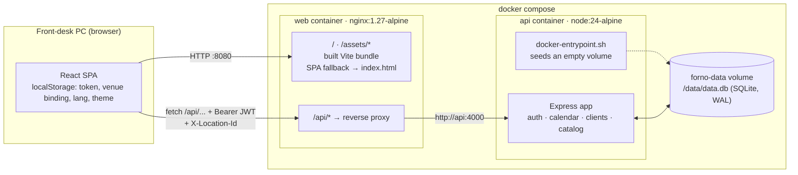
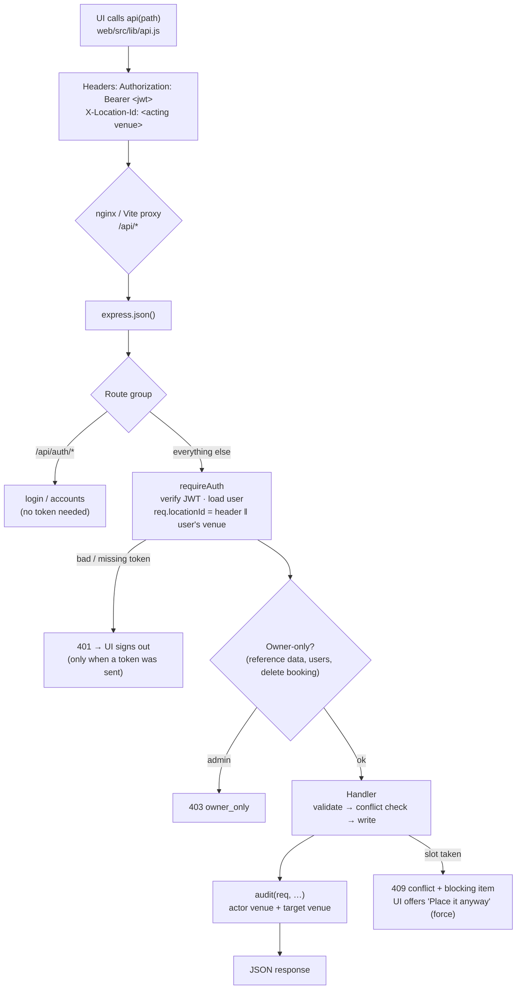
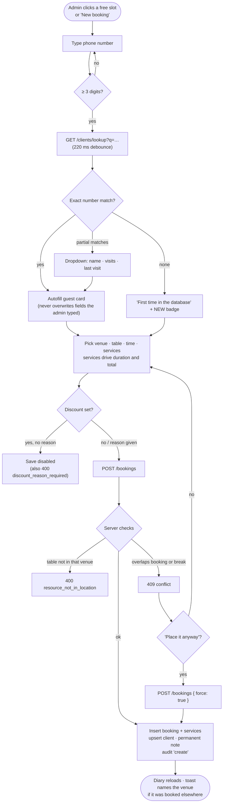
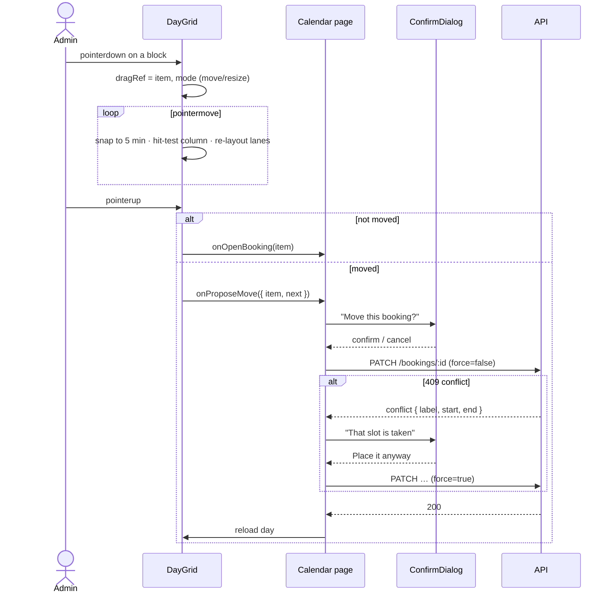
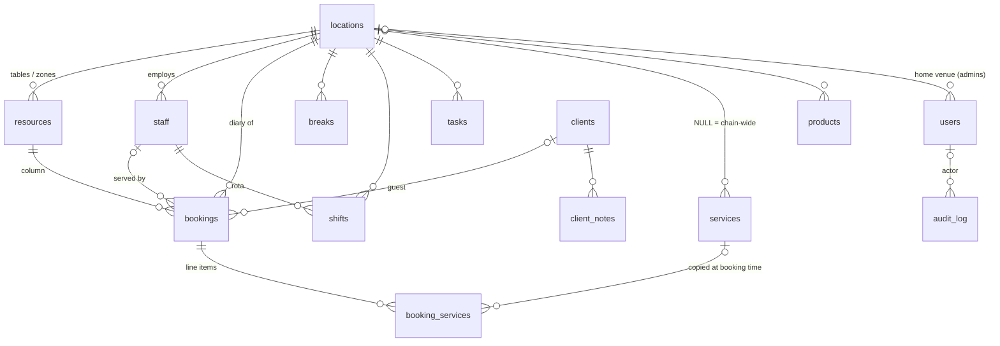

# Architecture

Forno is a two-tier app: a React single-page UI and a small Express API with
SQLite (`node:sqlite`) for storage. In production nginx serves the built UI and
reverse-proxies `/api` to the API container, so the browser only ever talks to
one origin.

- [Deployment topology](#deployment-topology)
- [Request lifecycle](#request-lifecycle)
- [Booking flow](#booking-flow)
- [Drag, confirm, persist](#drag-confirm-persist)
- [Data model](#data-model)
- [Key decisions](#key-decisions)
- [Source layout](#source-layout)

## Deployment topology



In development the same shape is produced by Vite: `npm run dev` serves the UI
on `:5173` and its dev-server proxy forwards `/api` to the API on `:4000`
(`API_PROXY_TARGET` overrides the target).

## Request lifecycle

Every authenticated call carries two pieces of context: **who** (the JWT) and
**which venue's diary** they are acting on (`X-Location-Id`). They differ when
an admin takes a forwarded call for another venue — the audit log records both.



## Booking flow

What happens between the admin typing a phone number and the block appearing
in the diary.



Cancelling follows the same rule as discounts: the dialog demands a written
reason, and `PATCH /bookings/:id { status: 'cancelled' }` without
`cancel_reason` is rejected by the API as well.

## Drag, confirm, persist

The diary never saves on drop. A drag only produces a *proposal*; the page asks
first, and a conflict asks a second time.



Callbacks are fired from the pointer-up handler, never from inside a React
state updater — StrictMode runs updaters twice, which used to open two
confirmation dialogs (and, on the task board, send the status change twice).

## Data model



- Times are a local calendar `day` (`YYYY-MM-DD`) plus `start_min`/`end_min`
  minute offsets from midnight. The chain runs in one timezone (set `TZ` on the
  API container), which keeps drag arithmetic exact and avoids DST bugs.
- Reference data is soft-deleted (`archived = 1`) so history still resolves
  retired staff and tables.
- `booking_services` copies name, duration and price at booking time, so a later
  price change does not rewrite past bills.
- `audit_log` stores actor venue and target venue separately; a mismatch is a
  forwarded call and is highlighted in the Activity screen.

## Key decisions

| Decision | Why |
| --- | --- |
| `node:sqlite`, no ORM, no native modules | Zero build step for the API; the image is plain `node:24-alpine`. One file to back up. |
| Single origin behind nginx | No CORS in production, the SPA fallback lives next to the API proxy, and fingerprinted `/assets` get a 1-year immutable cache while `index.html` is `no-cache`. |
| JWT (30 days) + device binding in `localStorage` | Front-desk PCs stay signed in; after sign-out the terminal still remembers its venue so only the password is asked for. |
| Server-side conflict detection with explicit `force` | Overlaps are visible and deliberate, never accidental, and the override is in the audit trail. |
| Reasons enforced in UI **and** API | Discounts and cancellations always explain themselves in the guest history. |
| Hand-written diary grid | Lanes for overlaps, 15-min grid, drag/resize with confirmation — none of which calendar libraries do the way the floor works. |

## Source layout

```
server/
  Dockerfile, docker-entrypoint.sh   API image; seeds an empty volume on first start
  src/index.js            Express app, route mounting, error handler
  src/lib/db.js           schema (CREATE IF NOT EXISTS) + query helpers
  src/lib/auth.js         JWT, requireAuth, acting-location resolution
  src/lib/audit.js        the write-trail
  src/routes/             auth, calendar, clients, catalog
  src/seed.js             demo dataset (resets the DB at DB_PATH)
  test/e2e.mjs            API integration suite
  test/run-e2e.mjs        boots a throwaway API + DB and runs the suite
web/
  Dockerfile, nginx.conf  UI image: Vite build served by nginx, /api proxied
  src/lib/api.js          fetch wrapper, token + venue headers, 401 handling
  src/lib/session.jsx     user, venues, device binding, theme
  src/components/ui/      shadcn-style primitives on Radix
  src/components/calendar/  day grid, tile, hover card, month view
  src/pages/              one file per screen
  src/i18n/               lv / en / ru dictionary
e2e/                      Playwright browser tests
scripts/screenshots.mjs   regenerates docs/screenshots
docker-compose.yml        api + web (nginx) + data volume
```
